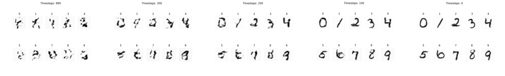

# Towards Stable Diffusion: Building Latent Diffusion Models using 🤗 Diffusers


[Medium Article](https://medium.com/@nevinbaiju_77488/towards-stable-diffusion-building-latent-diffusion-models-using-diffusers-3bda5cca63ee)

This repository demonstrates a **Conditional Latent Diffusion Model** for MNIST digit generation using the 🤗 Diffusers library. By leveraging latent space, diffusion models, and class conditioning, the model efficiently generates digits by denoising a latent representation. 

## Features

- **Conditional Image Generation**: Generates MNIST digits based on class labels.
- **Latent Diffusion**: Operates in compressed latent space for computational efficiency.
- **UNet Architecture**: Used for predicting noise at each diffusion step and denoising the latent representation.
- **Autoencoder (VAE)**: Encodes images to latent space and decodes them back to pixel space.

## Setup
1) Clone this repository.
2) Run ```pip install -r requirements.txt```
3) Run ```python train.py``` to train the models.
4) Run ```python main.py``` to generate digits.

## Acknowledgment

I would like to thank [@explainingai-code](https://github.com/explainingai-code/) and their video about stable diffusion that helped me gain a comprehensive idea about the diffusion process and the intricacies of conditional diffusion models. 